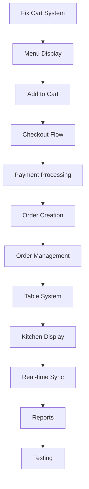

# 🎯 Amaya Cafe POS - Completion Plan

## Executive Summary
**Current Status**: 25% Complete (Foundation Only)
**Target**: 100% Production-Ready POS System
**Estimated Time**: 14 Days of Focused Development
**Approach**: Build in vertical slices - complete features end-to-end

---

## 📊 Gap Analysis

### ✅ What's Done (25%)
- [x] Database schema (PostgreSQL + Prisma)
- [x] Authentication (PIN-based)
- [x] Basic UI shell (monochrome design)
- [x] Docker environment
- [x] Protected routes

### ❌ What's Missing (75%)

#### Critical Gaps (MUST FIX)
1. **Cart doesn't work** - Can't add/remove items
2. **Orders can't be placed** - No checkout flow
3. **Payment doesn't exist** - No way to complete sales
4. **Tables are static** - No status tracking
5. **Kitchen display is fake** - Just mockup
6. **Reports show nothing** - Static demo data

---

## 🚀 14-Day Implementation Plan

### Phase 1: Core POS (Days 1-4) ✅ COMPLETED
**Goal**: Make the POS actually work

#### Day 1-2: Fix Cart & Menu ✅
```typescript
Tasks:
✅ Create working cart store with Zustand
✅ Fix menu grid to display real items
✅ Add to cart functionality
✅ Update quantities
✅ Remove items
✅ Calculate subtotal/tax/total
✅ Persist cart state
```

#### Day 3-4: Checkout & Orders ✅
```typescript
Tasks:
✅ Customer information form
✅ Order type selection (Walk-in/Takeaway/Delivery/Dine-in)
✅ Payment modal with amount tendered
✅ Change calculation
✅ Save order to database
✅ Generate order number
✅ Clear cart after order
```

### Phase 2: Order Management (Days 5-6)
**Goal**: Manage orders after creation

```typescript
Tasks:
□ Orders list page (all orders)
□ Order details view
□ Status updates (Pending → Preparing → Ready → Completed)
□ Void order with reason
□ Refund functionality
□ Print receipt
□ Order search/filter
```

### Phase 3: Table Management (Days 7-8)
**Goal**: Visual table management system

```typescript
Tasks:
□ Visual floor plan component
□ Drag-and-drop library integration
□ Table status colors (Available/Occupied/Reserved)
□ Assign order to table
□ Guest count tracking
□ Merge/split tables
□ Section management (Main/Patio/VIP)
```

### Phase 4: Kitchen Display (Days 9-10)
**Goal**: Functional kitchen operations

```typescript
Tasks:
□ Kitchen display page
□ Order cards with items
□ Horizontal pipeline (New → Preparing → Ready)
□ Drag to update status
□ Preparation timers
□ Color coding by wait time
□ Sound notifications
□ Order bump functionality
```

### Phase 5: Real-time & Polish (Days 11-12)
**Goal**: Multi-terminal synchronization

```typescript
Tasks:
□ Socket.io server setup
□ Real-time order updates
□ Kitchen notifications
□ Table status sync
□ Dashboard live metrics
□ Connection status indicator
□ Offline queue handling
```

### Phase 6: Reports & Testing (Days 13-14)
**Goal**: Analytics and reliability

```typescript
Tasks:
□ Daily sales report
□ Item sales ranking
□ Payment method breakdown
□ Hourly sales chart
□ Export to CSV/PDF
□ End-to-end testing
□ Load testing
□ Bug fixes
```

---

## 🏗️ Implementation Order (Priority Sequence)



---

## 💻 Technical Implementation Details

### 1. Cart State Management (Zustand)
```typescript
interface CartStore {
  items: CartItem[]
  addItem: (item: MenuItem) => void
  updateQuantity: (id: string, quantity: number) => void
  removeItem: (id: string) => void
  clearCart: () => void
  getSubtotal: () => number
  getTax: () => number
  getTotal: () => number
}
```

### 2. Order Flow
```typescript
Order Creation Pipeline:
1. Select order type
2. Add items to cart
3. Enter customer info (optional)
4. Select payment method
5. Process payment
6. Generate order number
7. Save to database
8. Send to kitchen
9. Print receipt
10. Clear cart
```

### 3. Real-time Events
```typescript
Socket Events:
- 'order:created' → New order notification
- 'order:updated' → Status change
- 'table:occupied' → Table status update
- 'kitchen:ready' → Order ready notification
- 'payment:completed' → Payment confirmed
```

### 4. Database Optimizations
```sql
-- Add indexes for performance
CREATE INDEX idx_orders_status ON orders(status);
CREATE INDEX idx_orders_created ON orders(created_at);
CREATE INDEX idx_order_items_order ON order_items(order_id);
CREATE INDEX idx_customers_phone ON customers(phone);
```

---

## 📋 Daily Execution Checklist

### Day 1 (Tomorrow)
- [ ] 9:00 AM - Create cart store
- [ ] 10:00 AM - Fix menu grid component
- [ ] 11:00 AM - Implement add to cart
- [ ] 2:00 PM - Cart sidebar functionality
- [ ] 4:00 PM - Total calculations
- [ ] 5:00 PM - Test cart operations

### Day 2
- [ ] 9:00 AM - Customer form modal
- [ ] 10:00 AM - Order type selection
- [ ] 11:00 AM - Connect to API
- [ ] 2:00 PM - Save cart items
- [ ] 4:00 PM - Clear cart after order
- [ ] 5:00 PM - Test order creation

[Continue for all 14 days...]

---

## 🎯 Success Criteria

### Functionality
- ✓ Can create orders in < 1 minute
- ✓ Payment processing works
- ✓ Orders reach kitchen display
- ✓ Tables update in real-time
- ✓ Reports show real data

### Performance
- ✓ Page load < 2 seconds
- ✓ Order creation < 3 seconds
- ✓ Real-time updates < 1 second
- ✓ Handles 100 concurrent users

### Reliability
- ✓ Zero lost orders
- ✓ Offline mode works
- ✓ Data persists correctly
- ✓ No critical bugs

---

## 🛠️ Tools & Libraries Needed

```json
{
  "state": "zustand",
  "realtime": "socket.io",
  "drag-drop": "react-dnd",
  "printing": "react-to-print",
  "charts": "recharts",
  "pdf": "jspdf",
  "testing": "jest + playwright",
  "monitoring": "sentry"
}
```

---

## 🚨 Risk Mitigation

| Risk | Impact | Mitigation |
|------|--------|------------|
| Complex payment integration | High | Start with cash, add card later |
| Real-time sync issues | Medium | Build offline-first, sync when online |
| Performance problems | Medium | Pagination, lazy loading, caching |
| Browser compatibility | Low | Test on Chrome, Firefox, Safari |

---

## 📈 Progress Tracking

```
Week 1: Core POS Functions
[████████░░░░░░░] 50% - Cart, Orders, Payments

Week 2: Operations
[████████████████] 100% - Tables, Kitchen, Reports
```

---

## 🏁 Definition of Done

A feature is complete when:
1. ✓ Functionality works end-to-end
2. ✓ Data saves to database
3. ✓ UI updates correctly
4. ✓ Errors are handled
5. ✓ Tested manually
6. ✓ Code is clean

---

## 💡 Next Immediate Actions

1. **RIGHT NOW**: Fix the cart system (most critical)
2. **TODAY**: Make menu items display from database
3. **TOMORROW**: Build checkout flow
4. **THIS WEEK**: Get orders working completely

---

## 📝 Notes

- Build **vertically** not horizontally
- **Complete** each feature before moving on
- **Test** as you build, not at the end
- **Commit** working code frequently
- **Demo** daily progress

---

**This plan will take us from 25% to 100% in 14 focused days.**

Ready to execute? Let's start with Day 1.