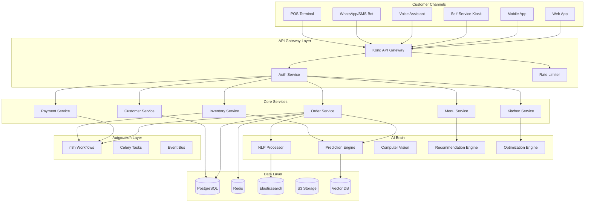
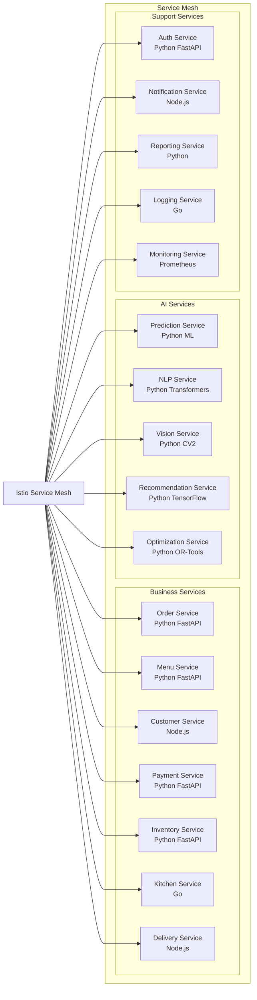
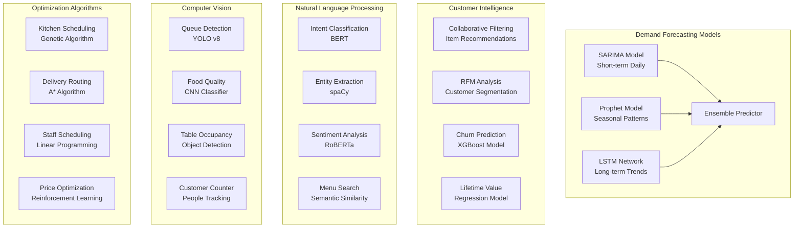
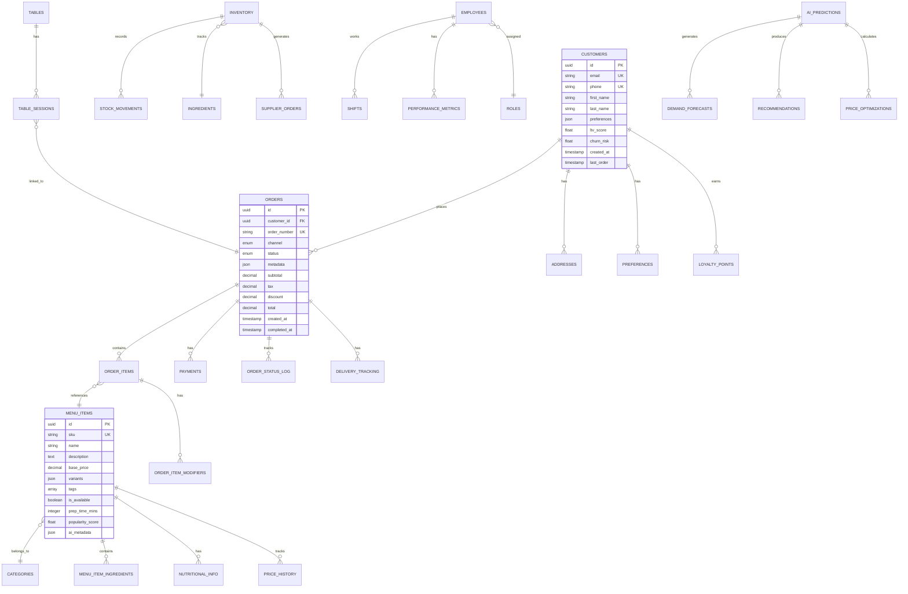
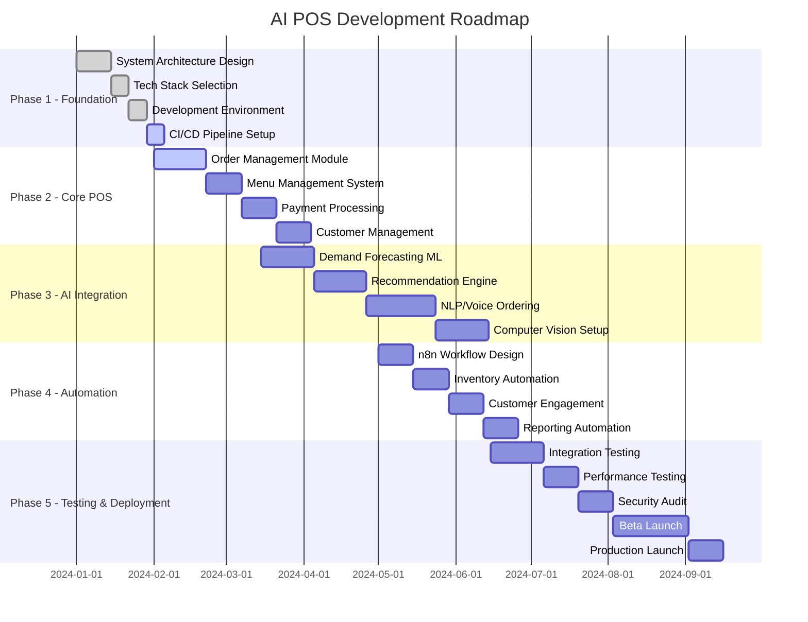
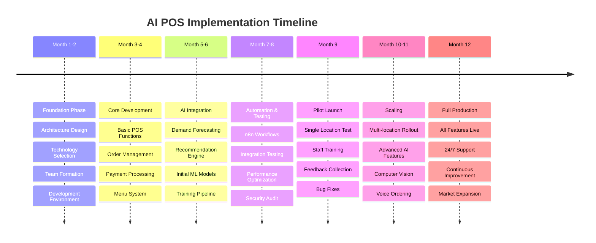

# AI-Powered POS System - Software Process Specification
## Version 1.0 | Next-Generation Restaurant Management Platform

---

## Executive Summary

### Project Vision
Transform traditional restaurant operations through an AI-first, automation-driven Point of Sale system that predicts, optimizes, and scales business operations while delivering exceptional customer experiences.

### Core Innovation Pillars
- **Predictive Intelligence**: Anticipate demand, prevent issues, optimize resources
- **Autonomous Operations**: Self-healing, self-optimizing, self-scaling systems
- **Conversational Commerce**: Natural language ordering across all channels
- **Real-time Optimization**: Continuous learning and adaptation
- **Zero-Touch Automation**: End-to-end workflow automation via n8n

### Success Metrics
- 50% reduction in operational costs
- 40% increase in revenue through AI optimization
- 90% customer satisfaction score
- 70% reduction in food waste
- 24/7 autonomous operation capability

---

## 1. System Architecture Overview

### 1.1 High-Level Architecture



### 1.2 Microservices Architecture



### 1.3 AI/ML Pipeline Architecture

```
┌─────────────────────────────────────────────────────────────────────────┐
│                          AI/ML Pipeline Architecture                      │
├─────────────────────────────────────────────────────────────────────────┤
│                                                                          │
│  Data Ingestion          Feature Engineering        Model Training       │
│  ┌────────────┐          ┌─────────────────┐      ┌──────────────┐    │
│  │ Real-time  │          │ Feature Store   │      │ MLflow       │    │
│  │ Streams    │────────> │ - Feast         │────> │ Experiments  │    │
│  └────────────┘          │ - Feature Eng   │      └──────────────┘    │
│  ┌────────────┐          └─────────────────┘      ┌──────────────┐    │
│  │ Batch ETL  │          ┌─────────────────┐      │ Model        │    │
│  │ - Airflow  │────────> │ Data Lake       │────> │ Registry     │    │
│  └────────────┘          │ - Delta Lake    │      └──────────────┘    │
│                          └─────────────────┘                           │
│                                                                          │
│  Model Serving           Monitoring              Feedback Loop          │
│  ┌────────────┐          ┌─────────────────┐      ┌──────────────┐    │
│  │ Triton     │          │ Prometheus      │      │ A/B Testing  │    │
│  │ Inference  │<──────── │ + Grafana       │<──── │ Framework    │    │
│  │ Server     │          └─────────────────┘      └──────────────┘    │
│  └────────────┘          ┌─────────────────┐      ┌──────────────┐    │
│  ┌────────────┐          │ Drift           │      │ Retraining   │    │
│  │ Edge       │────────> │ Detection       │────> │ Pipeline     │    │
│  │ Inference  │          └─────────────────┘      └──────────────┘    │
│  └────────────┘                                                        │
│                                                                          │
└─────────────────────────────────────────────────────────────────────────┘
```

---

## 2. Functional Requirements Specification

### 2.1 Core POS Features with AI Enhancement

```mermaid
stateDiagram-v2
    [*] --> CustomerIdentification

    CustomerIdentification --> OrderCreation: New/Returning

    state OrderCreation {
        [*] --> ChannelSelection
        ChannelSelection --> MenuBrowsing
        MenuBrowsing --> AIRecommendations
        AIRecommendations --> ItemSelection
        ItemSelection --> CartManagement
        CartManagement --> SpecialInstructions
    }

    OrderCreation --> OrderValidation

    state OrderValidation {
        [*] --> FraudCheck
        FraudCheck --> InventoryCheck
        InventoryCheck --> PricingCalculation
        PricingCalculation --> PromotionEngine
    }

    OrderValidation --> PaymentProcessing

    state PaymentProcessing {
        [*] --> PaymentMethodSelection
        PaymentMethodSelection --> PaymentValidation
        PaymentValidation --> PaymentExecution
        PaymentExecution --> ReceiptGeneration
    }

    PaymentProcessing --> OrderFulfillment

    state OrderFulfillment {
        [*] --> KitchenRouting
        KitchenRouting --> Preparation
        Preparation --> QualityCheck
        QualityCheck --> Ready
        Ready --> Delivery/Pickup
    }

    OrderFulfillment --> OrderCompletion
    OrderCompletion --> FeedbackLoop
    FeedbackLoop --> [*]
```



### 2.2 AI Feature Matrix

| Feature Category | Traditional POS | AI-Enhanced POS | Business Impact |
|-----------------|-----------------|-----------------|-----------------|
| **Order Taking** | Manual entry | Voice/NLP processing | 70% faster ordering |
| **Menu Display** | Static menu | Dynamic personalized menu | 40% higher AOV |
| **Pricing** | Fixed prices | Dynamic AI pricing | 25% revenue increase |
| **Inventory** | Manual tracking | Predictive forecasting | 50% waste reduction |
| **Kitchen Management** | FIFO queue | AI-optimized routing | 35% faster service |
| **Customer Service** | Human only | AI + Human hybrid | 60% cost reduction |
| **Marketing** | Mass campaigns | Hyper-personalized | 300% ROI improvement |
| **Staffing** | Fixed schedules | Demand-based scheduling | 30% labor optimization |

### 2.3 Detailed Functional Modules

```
┌────────────────────────────────────────────────────────────────────┐
│                    Functional Module Hierarchy                      │
├────────────────────────────────────────────────────────────────────┤
│                                                                     │
│ 1. Customer Management System                                      │
│    ├── Registration & Authentication                               │
│    │   ├── Multi-factor authentication                            │
│    │   ├── Social login integration                               │
│    │   └── Biometric support (face/fingerprint)                   │
│    ├── Profile Management                                          │
│    │   ├── Preference learning AI                                 │
│    │   ├── Dietary restrictions tracking                          │
│    │   └── Order history analytics                                │
│    └── Loyalty & Rewards                                           │
│        ├── Point accumulation engine                               │
│        ├── Tier management system                                  │
│        └── Personalized reward recommendations                     │
│                                                                     │
│ 2. Intelligent Menu Management                                     │
│    ├── Dynamic Menu Generation                                     │
│    │   ├── Time-based menu changes                                │
│    │   ├── Inventory-aware hiding                                 │
│    │   └── Weather-based recommendations                           │
│    ├── Multilingual Support                                       │
│    │   ├── Real-time translation                                  │
│    │   └── Cultural adaptation                                    │
│    └── Nutritional Intelligence                                    │
│        ├── Calorie tracking                                       │
│        ├── Allergen detection                                     │
│        └── Health score calculation                               │
│                                                                     │
│ 3. Order Processing Engine                                         │
│    ├── Multi-channel Order Intake                                  │
│    │   ├── Web/Mobile apps                                        │
│    │   ├── Voice ordering (Alexa/Google)                          │
│    │   ├── WhatsApp/SMS bot                                       │
│    │   └── Social media ordering                                  │
│    ├── Order Optimization                                          │
│    │   ├── Kitchen load balancing                                 │
│    │   ├── Prep time prediction                                   │
│    │   └── Delivery route optimization                            │
│    └── Order Tracking                                              │
│        ├── Real-time status updates                               │
│        ├── GPS tracking for delivery                              │
│        └── Predictive ETA                                         │
│                                                                     │
│ 4. AI-Powered Kitchen Display System                               │
│    ├── Intelligent Queue Management                                │
│    │   ├── Priority-based routing                                 │
│    │   ├── Station load balancing                                 │
│    │   └── Parallel preparation optimization                      │
│    ├── Recipe Assistance                                           │
│    │   ├── Step-by-step guidance                                  │
│    │   ├── Video instructions                                     │
│    │   └── Quality checkpoints                                    │
│    └── Performance Analytics                                       │
│        ├── Staff efficiency metrics                               │
│        ├── Bottleneck identification                              │
│        └── Training recommendations                               │
│                                                                     │
│ 5. Payment & Financial Management                                  │
│    ├── Multi-payment Processing                                    │
│    │   ├── Cards (NFC, chip, swipe)                              │
│    │   ├── Digital wallets                                        │
│    │   ├── Cryptocurrency                                         │
│    │   └── Buy-now-pay-later                                      │
│    ├── Fraud Detection AI                                          │
│    │   ├── Transaction pattern analysis                           │
│    │   ├── Velocity checks                                        │
│    │   └── Geographic anomaly detection                           │
│    └── Financial Reporting                                         │
│        ├── Real-time P&L                                          │
│        ├── Tax automation                                         │
│        └── Predictive cash flow                                   │
│                                                                     │
│ 6. Inventory & Supply Chain AI                                     │
│    ├── Demand Forecasting                                          │
│    │   ├── ML-based prediction                                    │
│    │   ├── Seasonal adjustments                                   │
│    │   └── Event-based scaling                                    │
│    ├── Automated Procurement                                       │
│    │   ├── Supplier integration                                   │
│    │   ├── Price optimization                                     │
│    │   └── Quality scoring                                        │
│    └── Waste Management                                            │
│        ├── Expiry tracking                                        │
│        ├── Usage optimization                                     │
│        └── Sustainability reporting                               │
│                                                                     │
└────────────────────────────────────────────────────────────────────┘
```

---

## 3. AI/ML Components Specification

### 3.1 Machine Learning Models Architecture



### 3.2 AI Model Specifications

```python
# Model Architecture Specifications

class ModelSpecifications:

    DEMAND_FORECASTING = {
        "model_type": "Ensemble",
        "components": [
            {
                "name": "SARIMA",
                "params": {"p": 2, "d": 1, "q": 2, "seasonal_order": (1,1,1,7)},
                "training_window": "90 days",
                "prediction_horizon": "1-7 days",
                "update_frequency": "daily"
            },
            {
                "name": "Prophet",
                "params": {"seasonality_mode": "multiplicative", "changepoint_prior_scale": 0.05},
                "features": ["holidays", "events", "weather"],
                "training_window": "365 days",
                "prediction_horizon": "1-30 days"
            },
            {
                "name": "LSTM",
                "architecture": {
                    "layers": [128, 64, 32],
                    "dropout": 0.2,
                    "activation": "relu",
                    "optimizer": "adam"
                },
                "sequence_length": 14,
                "batch_size": 32
            }
        ],
        "ensemble_method": "weighted_average",
        "performance_metrics": ["MAPE < 10%", "RMSE", "MAE"],
        "retraining_trigger": "MAPE > 15% for 3 consecutive days"
    }

    RECOMMENDATION_ENGINE = {
        "model_type": "Hybrid",
        "collaborative_filtering": {
            "algorithm": "ALS",
            "factors": 100,
            "regularization": 0.01,
            "iterations": 20
        },
        "content_based": {
            "features": ["cuisine_type", "price_range", "dietary_tags", "ingredients"],
            "similarity_metric": "cosine",
            "embedding_dim": 256
        },
        "contextual_bandits": {
            "algorithm": "LinUCB",
            "alpha": 0.1,
            "features": ["time_of_day", "weather", "day_of_week", "user_state"]
        },
        "business_rules": [
            "boost_high_margin_items",
            "promote_expiring_inventory",
            "cross_sell_beverages",
            "upsell_desserts"
        ]
    }

    NLP_PIPELINE = {
        "voice_ordering": {
            "stt_model": "Whisper large-v3",
            "language_model": "GPT-4",
            "intent_classifier": "BERT-base-uncased",
            "entity_extractor": "spaCy en_core_web_lg",
            "confidence_threshold": 0.85
        },
        "chatbot": {
            "model": "GPT-4-turbo",
            "max_tokens": 150,
            "temperature": 0.7,
            "system_prompt": "restaurant_assistant_v2",
            "fallback_to_human": "confidence < 0.7"
        }
    }

    COMPUTER_VISION = {
        "queue_detection": {
            "model": "YOLOv8n",
            "input_size": [640, 640],
            "confidence_threshold": 0.5,
            "nms_threshold": 0.4,
            "tracking": "DeepSORT"
        },
        "food_quality": {
            "model": "EfficientNet-B4",
            "classes": ["perfect", "acceptable", "remake_required"],
            "augmentation": ["rotation", "flip", "brightness"],
            "training_samples": 10000
        }
    }

    OPTIMIZATION = {
        "pricing": {
            "algorithm": "Deep Q-Network",
            "state_space": ["demand", "inventory", "competition", "time"],
            "action_space": "discrete_price_multipliers",
            "reward": "revenue - waste_cost",
            "exploration_rate": 0.1
        },
        "kitchen_scheduling": {
            "algorithm": "Genetic Algorithm",
            "population_size": 100,
            "generations": 500,
            "crossover_rate": 0.8,
            "mutation_rate": 0.02
        }
    }
```

---

## 4. n8n Automation Workflows

### 4.1 Workflow Architecture

```
┌─────────────────────────────────────────────────────────────────────────┐
│                         n8n Workflow Architecture                        │
├─────────────────────────────────────────────────────────────────────────┤
│                                                                          │
│  Triggers                  Workflows                    Actions          │
│  ┌────────────┐           ┌────────────┐              ┌────────────┐   │
│  │ Webhooks   │───────────│ Order      │──────────────│ Database   │   │
│  │            │           │ Processing │              │ Updates    │   │
│  └────────────┘           └────────────┘              └────────────┘   │
│  ┌────────────┐           ┌────────────┐              ┌────────────┐   │
│  │ Schedules  │───────────│ Inventory  │──────────────│ API Calls  │   │
│  │            │           │ Management │              │            │   │
│  └────────────┘           └────────────┘              └────────────┘   │
│  ┌────────────┐           ┌────────────┐              ┌────────────┐   │
│  │ Database   │───────────│ Customer   │──────────────│ Email/SMS  │   │
│  │ Changes    │           │ Engagement │              │ Dispatch   │   │
│  └────────────┘           └────────────┘              └────────────┘   │
│  ┌────────────┐           ┌────────────┐              ┌────────────┐   │
│  │ API Events │───────────│ Analytics  │──────────────│ Reports    │   │
│  │            │           │ & Reporting│              │ Generation │   │
│  └────────────┘           └────────────┘              └────────────┘   │
│  ┌────────────┐           ┌────────────┐              ┌────────────┐   │
│  │ IoT Sensors│───────────│ Maintenance│──────────────│ Alerts     │   │
│  │            │           │ & Alerts   │              │            │   │
│  └────────────┘           └────────────┘              └────────────┘   │
│                                                                          │
└─────────────────────────────────────────────────────────────────────────┘
```

### 4.2 Critical n8n Workflows

```yaml
# Workflow 1: Intelligent Order Processing
name: "AI_Order_Processing"
trigger:
  - type: "webhook"
    endpoint: "/orders/new"
    method: "POST"
nodes:
  - id: "validate_order"
    type: "function"
    operation: "validate_customer_data"

  - id: "fraud_check"
    type: "http_request"
    url: "{{AI_SERVICE}}/fraud/check"
    method: "POST"

  - id: "inventory_check"
    type: "postgres"
    operation: "SELECT"
    query: "CHECK_INVENTORY_AVAILABILITY"

  - id: "ai_recommendations"
    type: "http_request"
    url: "{{AI_SERVICE}}/recommendations"

  - id: "price_optimization"
    type: "http_request"
    url: "{{AI_SERVICE}}/pricing/optimize"

  - id: "route_to_kitchen"
    type: "switch"
    rules:
      - condition: "order.type == 'delivery'"
        output: "delivery_workflow"
      - condition: "order.type == 'dine_in'"
        output: "kitchen_workflow"

  - id: "send_notifications"
    type: "multi_output"
    outputs:
      - type: "email"
      - type: "sms"
      - type: "push_notification"
      - type: "whatsapp"

# Workflow 2: Predictive Inventory Management
name: "Predictive_Inventory"
trigger:
  - type: "cron"
    expression: "0 2 * * *"  # Daily at 2 AM
nodes:
  - id: "fetch_sales_data"
    type: "postgres"
    query: "SELECT * FROM sales WHERE date >= NOW() - INTERVAL '90 days'"

  - id: "run_prediction"
    type: "http_request"
    url: "{{ML_SERVICE}}/predict/demand"
    method: "POST"

  - id: "calculate_orders"
    type: "function"
    code: |
      const predictions = $input.predictions;
      const current_stock = $input.stock;
      const safety_buffer = 1.2;

      return predictions.map(item => ({
        item_id: item.id,
        order_quantity: Math.max(0, (item.predicted * 3 * safety_buffer) - current_stock[item.id])
      })).filter(order => order.order_quantity > 0);

  - id: "check_supplier_prices"
    type: "parallel"
    operations:
      - "supplier_a_api"
      - "supplier_b_api"
      - "supplier_c_api"

  - id: "optimize_purchase_order"
    type: "http_request"
    url: "{{AI_SERVICE}}/optimize/purchase_order"

  - id: "create_purchase_orders"
    type: "postgres"
    operation: "INSERT"
    table: "purchase_orders"

  - id: "send_to_suppliers"
    type: "email"
    template: "purchase_order"

  - id: "update_dashboard"
    type: "websocket"
    event: "inventory_forecast_updated"

# Workflow 3: Customer Retention Automation
name: "Customer_Retention_AI"
trigger:
  - type: "postgres"
    event: "INSERT OR UPDATE"
    table: "customer_metrics"
    condition: "churn_risk_score > 0.7"
nodes:
  - id: "analyze_customer"
    type: "http_request"
    url: "{{AI_SERVICE}}/customer/analyze"

  - id: "generate_offer"
    type: "http_request"
    url: "{{AI_SERVICE}}/offers/personalized"

  - id: "segment_action"
    type: "switch"
    rules:
      - condition: "customer.value == 'high'"
        output: "vip_treatment"
      - condition: "customer.value == 'medium'"
        output: "standard_retention"
      - condition: "customer.value == 'low'"
        output: "automated_campaign"

  - id: "execute_retention"
    type: "multi_channel"
    channels:
      - sms: "{{personalized_message}}"
      - email: "{{retention_template}}"
      - app_notification: "{{special_offer}}"

  - id: "schedule_followup"
    type: "delay"
    wait: "72 hours"
    then: "check_engagement"

  - id: "measure_success"
    type: "postgres"
    operation: "UPDATE"
    query: "UPDATE retention_campaigns SET status = :status WHERE customer_id = :id"
```

---

## 5. Data Architecture

### 5.1 Database Schema Design



### 5.2 Data Flow Architecture

```
┌──────────────────────────────────────────────────────────────────────────┐
│                            Data Flow Pipeline                              │
├──────────────────────────────────────────────────────────────────────────┤
│                                                                            │
│   Data Sources           Ingestion            Processing          Storage  │
│                                                                            │
│   ┌────────────┐        ┌────────────┐      ┌────────────┐    ┌────────┐│
│   │POS Terminal│───────>│            │      │            │    │        ││
│   └────────────┘        │            │      │   Stream   │    │ Redis  ││
│   ┌────────────┐        │   Kafka    │─────>│ Processing │───>│ Cache  ││
│   │Mobile Apps │───────>│  Cluster   │      │  (Flink)   │    └────────┘│
│   └────────────┘        │            │      │            │    ┌────────┐│
│   ┌────────────┐        │            │      └────────────┘    │Postgres││
│   │Web Orders  │───────>│            │      ┌────────────┐    │  OLTP  ││
│   └────────────┘        └────────────┘      │            │    └────────┘│
│   ┌────────────┐        ┌────────────┐      │   Batch    │    ┌────────┐│
│   │IoT Sensors │───────>│            │─────>│ Processing │───>│ Data   ││
│   └────────────┘        │  Airflow   │      │  (Spark)   │    │ Lake   ││
│   ┌────────────┐        │    DAGs    │      │            │    └────────┘│
│   │3rd Party   │───────>│            │      └────────────┘    ┌────────┐│
│   │APIs        │        └────────────┘      ┌────────────┐    │Elastic ││
│   └────────────┘                            │    ML      │    │ Search ││
│   ┌────────────┐                            │  Pipeline  │    └────────┘│
│   │Logs/Events │───────────────────────────>│  (MLflow)  │    ┌────────┐│
│   └────────────┘                            └────────────┘    │Vector  ││
│                                                               │   DB   ││
│                                                               └────────┘│
└──────────────────────────────────────────────────────────────────────────┘
```

---

## 6. API Architecture Specification

### 6.1 RESTful API Design

```yaml
openapi: 3.0.0
info:
  title: AI POS System API
  version: 1.0.0
  description: Next-generation restaurant management API

servers:
  - url: https://api.aipos.com/v1
    description: Production API
  - url: https://staging-api.aipos.com/v1
    description: Staging API

paths:
  /orders:
    post:
      summary: Create a new order
      requestBody:
        required: true
        content:
          application/json:
            schema:
              type: object
              required:
                - customer_id
                - items
                - channel
              properties:
                customer_id:
                  type: string
                  format: uuid
                items:
                  type: array
                  items:
                    $ref: '#/components/schemas/OrderItem'
                channel:
                  type: string
                  enum: [pos, web, mobile, kiosk, voice, chat]
                special_instructions:
                  type: string
                  maxLength: 500
      responses:
        201:
          description: Order created successfully
          content:
            application/json:
              schema:
                $ref: '#/components/schemas/Order'
        400:
          description: Invalid request
        402:
          description: Payment required
        409:
          description: Inventory conflict

  /ai/recommendations/{customer_id}:
    get:
      summary: Get AI-powered recommendations
      parameters:
        - name: customer_id
          in: path
          required: true
          schema:
            type: string
            format: uuid
        - name: context
          in: query
          schema:
            type: object
            properties:
              time_of_day:
                type: string
              weather:
                type: string
              occasion:
                type: string
      responses:
        200:
          description: Personalized recommendations
          content:
            application/json:
              schema:
                type: object
                properties:
                  recommendations:
                    type: array
                    items:
                      $ref: '#/components/schemas/Recommendation'
                  reasoning:
                    type: string
                  confidence_score:
                    type: number
                    minimum: 0
                    maximum: 1

  /analytics/predict/demand:
    post:
      summary: Get demand predictions
      requestBody:
        required: true
        content:
          application/json:
            schema:
              type: object
              properties:
                item_ids:
                  type: array
                  items:
                    type: string
                horizon_days:
                  type: integer
                  minimum: 1
                  maximum: 30
                confidence_level:
                  type: number
                  default: 0.95
      responses:
        200:
          description: Demand forecast
          content:
            application/json:
              schema:
                type: object
                properties:
                  predictions:
                    type: array
                    items:
                      type: object
                      properties:
                        item_id:
                          type: string
                        date:
                          type: string
                          format: date
                        predicted_quantity:
                          type: number
                        confidence_interval:
                          type: object
                          properties:
                            lower:
                              type: number
                            upper:
                              type: number
```

### 6.2 GraphQL API Schema

```graphql
type Query {
  # Customer queries
  customer(id: ID!): Customer
  customerByPhone(phone: String!): Customer
  searchCustomers(query: String!, limit: Int = 10): [Customer!]!

  # Order queries
  order(id: ID!): Order
  orders(
    filter: OrderFilter
    sort: OrderSort
    pagination: PaginationInput
  ): OrderConnection!

  # Menu queries
  menu(channel: OrderChannel!): Menu
  menuItem(id: ID!): MenuItem
  searchMenu(query: String!, filters: MenuFilters): [MenuItem!]!

  # AI queries
  recommendations(
    customerId: ID!
    context: RecommendationContext
  ): RecommendationResponse!

  demandForecast(
    itemIds: [ID!]!
    days: Int!
  ): [DemandPrediction!]!

  # Analytics queries
  salesAnalytics(
    startDate: DateTime!
    endDate: DateTime!
    groupBy: AnalyticsGroupBy!
  ): SalesAnalytics!
}

type Mutation {
  # Order mutations
  createOrder(input: CreateOrderInput!): OrderResult!
  updateOrderStatus(
    orderId: ID!
    status: OrderStatus!
    metadata: JSON
  ): Order!

  # Customer mutations
  createCustomer(input: CreateCustomerInput!): Customer!
  updateCustomerPreferences(
    customerId: ID!
    preferences: PreferencesInput!
  ): Customer!

  # AI mutations
  trainModel(modelType: ModelType!, parameters: JSON): TrainingJob!
  provideFeedback(
    predictionId: ID!
    feedback: FeedbackInput!
  ): Feedback!
}

type Subscription {
  # Real-time order updates
  orderStatusChanged(orderId: ID!): Order!
  newOrder(channel: OrderChannel): Order!

  # Kitchen display updates
  kitchenQueueUpdated(stationId: ID!): KitchenQueue!

  # Inventory alerts
  lowStockAlert(threshold: Float!): InventoryAlert!

  # AI predictions
  demandForecastUpdated(itemId: ID!): DemandPrediction!
}

type Order {
  id: ID!
  orderNumber: String!
  customer: Customer!
  items: [OrderItem!]!
  status: OrderStatus!
  channel: OrderChannel!
  subtotal: Float!
  tax: Float!
  discount: Float!
  total: Float!
  estimatedReadyTime: DateTime
  aiMetadata: AIOrderMetadata
  createdAt: DateTime!
  updatedAt: DateTime!
}

type AIOrderMetadata {
  fraudScore: Float!
  preparationTimeEstimate: Int!
  customSuggestions: [MenuItem!]
  optimalKitchenRoute: [KitchenStation!]
  deliveryTimeEstimate: Int
  customerSatisfactionPrediction: Float
}
```

### 6.3 WebSocket Events

```typescript
// WebSocket Event Definitions

interface WebSocketEvents {
  // Order Events
  'order:created': {
    order: Order;
    predictions: {
      prepTime: number;
      customerSatisfaction: number;
    };
  };

  'order:statusChanged': {
    orderId: string;
    previousStatus: OrderStatus;
    newStatus: OrderStatus;
    timestamp: Date;
  };

  // Kitchen Events
  'kitchen:orderReceived': {
    order: Order;
    station: KitchenStation;
    priority: number;
  };

  'kitchen:orderCompleted': {
    orderId: string;
    actualPrepTime: number;
    predictedPrepTime: number;
  };

  // AI Events
  'ai:demandSpike': {
    items: Array<{
      itemId: string;
      currentDemand: number;
      normalDemand: number;
      spikePercentage: number;
    }>;
  };

  'ai:priceOptimization': {
    items: Array<{
      itemId: string;
      currentPrice: number;
      suggestedPrice: number;
      expectedRevenueLift: number;
    }>;
  };

  // Inventory Events
  'inventory:lowStock': {
    items: Array<{
      itemId: string;
      currentStock: number;
      reorderPoint: number;
      suggestedOrderQuantity: number;
    }>;
  };

  // Customer Events
  'customer:vipArrived': {
    customer: Customer;
    preferences: CustomerPreferences;
    suggestedActions: string[];
  };
}

// WebSocket Connection Manager
class WebSocketManager {
  private ws: WebSocket;
  private reconnectAttempts = 0;
  private maxReconnectAttempts = 5;
  private reconnectDelay = 1000;

  constructor(private url: string) {
    this.connect();
  }

  private connect(): void {
    this.ws = new WebSocket(this.url);

    this.ws.onopen = () => {
      console.log('WebSocket connected');
      this.reconnectAttempts = 0;
      this.authenticate();
    };

    this.ws.onmessage = (event: MessageEvent) => {
      const data = JSON.parse(event.data);
      this.handleMessage(data);
    };

    this.ws.onerror = (error: Event) => {
      console.error('WebSocket error:', error);
    };

    this.ws.onclose = () => {
      this.handleReconnection();
    };
  }

  private handleReconnection(): void {
    if (this.reconnectAttempts < this.maxReconnectAttempts) {
      setTimeout(() => {
        this.reconnectAttempts++;
        this.connect();
      }, this.reconnectDelay * Math.pow(2, this.reconnectAttempts));
    }
  }

  public emit<K extends keyof WebSocketEvents>(
    event: K,
    data: WebSocketEvents[K]
  ): void {
    if (this.ws.readyState === WebSocket.OPEN) {
      this.ws.send(JSON.stringify({ event, data }));
    }
  }
}
```

---

## 7. Security Architecture

### 7.1 Security Layers

```
┌────────────────────────────────────────────────────────────────────────┐
│                         Security Architecture                           │
├────────────────────────────────────────────────────────────────────────┤
│                                                                         │
│  Layer 1: Network Security                                             │
│  ┌──────────────────────────────────────────────────────────────────┐  │
│  │ • CloudFlare DDoS Protection                                      │  │
│  │ • AWS WAF Rules                                                   │  │
│  │ • VPC with Private Subnets                                        │  │
│  │ • SSL/TLS 1.3 Everywhere                                          │  │
│  └──────────────────────────────────────────────────────────────────┘  │
│                                                                         │
│  Layer 2: Application Security                                         │
│  ┌──────────────────────────────────────────────────────────────────┐  │
│  │ • OAuth 2.0 + JWT Authentication                                  │  │
│  │ • Role-Based Access Control (RBAC)                                │  │
│  │ • API Rate Limiting                                               │  │
│  │ • Input Validation & Sanitization                                 │  │
│  └──────────────────────────────────────────────────────────────────┘  │
│                                                                         │
│  Layer 3: Data Security                                                │
│  ┌──────────────────────────────────────────────────────────────────┐  │
│  │ • AES-256 Encryption at Rest                                      │  │
│  │ • TLS 1.3 Encryption in Transit                                   │  │
│  │ • Field-Level Encryption for PII                                  │  │
│  │ • Tokenization of Payment Data                                    │  │
│  └──────────────────────────────────────────────────────────────────┘  │
│                                                                         │
│  Layer 4: AI/ML Security                                               │
│  ┌──────────────────────────────────────────────────────────────────┐  │
│  │ • Model Versioning & Rollback                                     │  │
│  │ • Adversarial Attack Detection                                    │  │
│  │ • Privacy-Preserving ML (Differential Privacy)                    │  │
│  │ • Model Access Auditing                                           │  │
│  └──────────────────────────────────────────────────────────────────┘  │
│                                                                         │
│  Layer 5: Compliance & Audit                                           │
│  ┌──────────────────────────────────────────────────────────────────┐  │
│  │ • PCI DSS Compliance                                              │  │
│  │ • GDPR/CCPA Compliance                                            │  │
│  │ • SOC 2 Type II                                                   │  │
│  │ • Comprehensive Audit Logging                                     │  │
│  └──────────────────────────────────────────────────────────────────┘  │
│                                                                         │
└────────────────────────────────────────────────────────────────────────┘
```

---

## 8. Development Methodology

### 8.1 Agile Development Process



### 8.2 Sprint Structure

```
Sprint Planning (2-week sprints)
────────────────────────────────
Week 1:
  Monday:    Sprint Planning (4 hrs)
             - Review backlog
             - Estimate stories
             - Commit to sprint goals

  Tue-Thu:   Development
             - Daily standups (15 min)
             - Pair programming sessions
             - Code reviews

  Friday:    Integration Day
             - Merge feature branches
             - Run integration tests
             - Deploy to staging

Week 2:
  Mon-Wed:   Development & Testing
             - Complete features
             - Write tests
             - Fix bugs

  Thursday:  Demo Preparation
             - Prepare demo environment
             - Create presentation
             - Final testing

  Friday:    Sprint Review & Retro
             - Demo to stakeholders (2 hrs)
             - Retrospective (1 hr)
             - Backlog grooming (1 hr)
```

---

## 9. Testing Strategy

### 9.1 Testing Pyramid

```
                           ┌─────────────┐
                          │   E2E Tests  │
                          │     (10%)    │
                          └──────┬───────┘
                     ┌───────────┴────────────┐
                    │   Integration Tests     │
                    │         (30%)           │
                    └───────────┬─────────────┘
               ┌────────────────┴────────────────┐
              │       Unit Tests                 │
              │          (60%)                   │
              └──────────────────────────────────┘

Test Coverage Requirements:
- Unit Tests: >90% coverage
- Integration Tests: All API endpoints
- E2E Tests: Critical user journeys
- Performance Tests: <200ms API response
- Load Tests: 10,000 concurrent users
- Security Tests: OWASP Top 10
```

### 9.2 AI Model Testing

```python
class AIModelTestingFramework:
    """
    Comprehensive testing framework for AI models
    """

    def test_model_accuracy(self, model, test_data):
        """Test model accuracy meets requirements"""
        predictions = model.predict(test_data.features)
        accuracy = accuracy_score(test_data.labels, predictions)
        assert accuracy > 0.95, f"Model accuracy {accuracy} below threshold"

    def test_model_fairness(self, model, protected_attributes):
        """Test for bias in model predictions"""
        for attribute in protected_attributes:
            group_predictions = model.predict(test_data[attribute])
            fairness_metric = calculate_fairness(group_predictions)
            assert fairness_metric > 0.8, f"Bias detected for {attribute}"

    def test_model_robustness(self, model, adversarial_examples):
        """Test model against adversarial attacks"""
        for example in adversarial_examples:
            prediction = model.predict(example)
            assert prediction.confidence > 0.7, "Model vulnerable to attack"

    def test_model_performance(self, model, load_test_data):
        """Test model inference performance"""
        start_time = time.time()
        predictions = model.predict_batch(load_test_data)
        inference_time = time.time() - start_time
        assert inference_time < 0.1, f"Inference too slow: {inference_time}s"

    def test_data_drift(self, model, current_data, training_data):
        """Test for data drift"""
        drift_score = calculate_drift(current_data, training_data)
        assert drift_score < 0.2, f"Significant data drift detected: {drift_score}"
```

---

## 10. Deployment Architecture

### 10.1 Kubernetes Deployment

```yaml
apiVersion: apps/v1
kind: Deployment
metadata:
  name: ai-pos-api
  namespace: production
spec:
  replicas: 3
  strategy:
    type: RollingUpdate
    rollingUpdate:
      maxSurge: 1
      maxUnavailable: 0
  selector:
    matchLabels:
      app: ai-pos-api
  template:
    metadata:
      labels:
        app: ai-pos-api
        version: v1.0.0
    spec:
      containers:
      - name: api
        image: aipos/api:1.0.0
        ports:
        - containerPort: 8000
        env:
        - name: DATABASE_URL
          valueFrom:
            secretKeyRef:
              name: db-credentials
              key: url
        - name: AI_SERVICE_URL
          value: "http://ai-service:8001"
        resources:
          requests:
            memory: "512Mi"
            cpu: "500m"
          limits:
            memory: "1Gi"
            cpu: "1000m"
        livenessProbe:
          httpGet:
            path: /health
            port: 8000
          initialDelaySeconds: 30
          periodSeconds: 10
        readinessProbe:
          httpGet:
            path: /ready
            port: 8000
          initialDelaySeconds: 5
          periodSeconds: 5

      - name: ai-sidecar
        image: aipos/ai-inference:1.0.0
        ports:
        - containerPort: 8001
        resources:
          requests:
            memory: "1Gi"
            cpu: "1000m"
          limits:
            memory: "2Gi"
            cpu: "2000m"
            nvidia.com/gpu: 1  # GPU for ML inference

---
apiVersion: v1
kind: Service
metadata:
  name: ai-pos-api
  namespace: production
spec:
  selector:
    app: ai-pos-api
  ports:
  - port: 80
    targetPort: 8000
  type: LoadBalancer

---
apiVersion: autoscaling/v2
kind: HorizontalPodAutoscaler
metadata:
  name: ai-pos-api-hpa
  namespace: production
spec:
  scaleTargetRef:
    apiVersion: apps/v1
    kind: Deployment
    name: ai-pos-api
  minReplicas: 3
  maxReplicas: 10
  metrics:
  - type: Resource
    resource:
      name: cpu
      target:
        type: Utilization
        averageUtilization: 70
  - type: Resource
    resource:
      name: memory
      target:
        type: Utilization
        averageUtilization: 80
  - type: Pods
    pods:
      metric:
        name: custom_api_requests_per_second
      target:
        type: AverageValue
        averageValue: "1000"
```

### 10.2 Infrastructure as Code

```hcl
# Terraform configuration for AI POS infrastructure

provider "aws" {
  region = var.aws_region
}

# VPC and Networking
module "vpc" {
  source = "./modules/vpc"

  cidr_block = "10.0.0.0/16"
  availability_zones = ["us-east-1a", "us-east-1b", "us-east-1c"]

  public_subnets = ["10.0.1.0/24", "10.0.2.0/24", "10.0.3.0/24"]
  private_subnets = ["10.0.10.0/24", "10.0.11.0/24", "10.0.12.0/24"]

  enable_nat_gateway = true
  enable_vpn_gateway = true
}

# EKS Cluster
module "eks" {
  source = "./modules/eks"

  cluster_name = "ai-pos-cluster"
  cluster_version = "1.27"

  vpc_id = module.vpc.vpc_id
  subnet_ids = module.vpc.private_subnets

  node_groups = {
    general = {
      desired_capacity = 3
      max_capacity = 10
      min_capacity = 3
      instance_types = ["t3.large"]
    }

    ai_workloads = {
      desired_capacity = 2
      max_capacity = 5
      min_capacity = 1
      instance_types = ["g4dn.xlarge"]  # GPU instances

      taints = [{
        key = "ai-workload"
        value = "true"
        effect = "NO_SCHEDULE"
      }]
    }
  }
}

# RDS Database
module "rds" {
  source = "./modules/rds"

  identifier = "ai-pos-db"
  engine = "postgres"
  engine_version = "15.3"
  instance_class = "db.r6g.xlarge"

  allocated_storage = 100
  storage_encrypted = true

  database_name = "aipos"
  master_username = "aipos_admin"

  vpc_security_group_ids = [module.vpc.database_security_group_id]
  subnet_group_name = module.vpc.database_subnet_group

  backup_retention_period = 30
  backup_window = "03:00-04:00"
  maintenance_window = "sun:04:00-sun:05:00"

  enabled_cloudwatch_logs_exports = ["postgresql"]

  performance_insights_enabled = true
  monitoring_interval = 60
}

# ElastiCache Redis
module "redis" {
  source = "./modules/elasticache"

  cluster_id = "ai-pos-cache"
  engine = "redis"
  node_type = "cache.r6g.large"
  num_cache_nodes = 3

  parameter_group_name = "default.redis7"
  port = 6379

  subnet_group_name = module.vpc.elasticache_subnet_group
  security_group_ids = [module.vpc.redis_security_group_id]

  snapshot_retention_limit = 5
  snapshot_window = "03:00-05:00"

  notification_topic_arn = aws_sns_topic.cache_notifications.arn
}

# S3 Buckets
resource "aws_s3_bucket" "ml_models" {
  bucket = "ai-pos-ml-models"

  versioning {
    enabled = true
  }

  server_side_encryption_configuration {
    rule {
      apply_server_side_encryption_by_default {
        sse_algorithm = "AES256"
      }
    }
  }

  lifecycle_rule {
    enabled = true

    transition {
      days = 30
      storage_class = "INTELLIGENT_TIERING"
    }
  }
}

# CloudFront CDN
module "cdn" {
  source = "./modules/cloudfront"

  origin_domain = module.alb.dns_name

  geo_restriction_locations = []
  geo_restriction_type = "none"

  cache_behaviors = {
    "/api/*" = {
      cached = false
      ttl = 0
    }
    "/static/*" = {
      cached = true
      ttl = 86400
    }
  }

  waf_web_acl_id = module.waf.web_acl_id
}
```

---

## 11. Monitoring & Observability

### 11.1 Monitoring Stack

```yaml
# Prometheus configuration
global:
  scrape_interval: 15s
  evaluation_interval: 15s

scrape_configs:
  - job_name: 'kubernetes-pods'
    kubernetes_sd_configs:
    - role: pod
    relabel_configs:
    - source_labels: [__meta_kubernetes_pod_annotation_prometheus_io_scrape]
      action: keep
      regex: true
    - source_labels: [__meta_kubernetes_pod_annotation_prometheus_io_path]
      action: replace
      target_label: __metrics_path__
      regex: (.+)

  - job_name: 'ai-models'
    static_configs:
    - targets:
      - 'model-serving-1:9090'
      - 'model-serving-2:9090'
    metrics_path: /metrics
    params:
      module: [ml_metrics]

# Grafana Dashboard JSON
{
  "dashboard": {
    "title": "AI POS System Dashboard",
    "panels": [
      {
        "title": "Order Volume",
        "type": "graph",
        "targets": [
          {
            "expr": "rate(orders_created_total[5m])",
            "legendFormat": "Orders/sec"
          }
        ]
      },
      {
        "title": "AI Model Performance",
        "type": "graph",
        "targets": [
          {
            "expr": "histogram_quantile(0.95, model_inference_duration_seconds)",
            "legendFormat": "P95 Latency"
          }
        ]
      },
      {
        "title": "Revenue Real-time",
        "type": "stat",
        "targets": [
          {
            "expr": "sum(rate(revenue_total[1h]))",
            "legendFormat": "Hourly Revenue"
          }
        ]
      },
      {
        "title": "System Health",
        "type": "heatmap",
        "targets": [
          {
            "expr": "up{job=~\".*\"}",
            "legendFormat": "{{job}}"
          }
        ]
      }
    ]
  }
}
```

### 11.2 Logging Architecture

```
┌────────────────────────────────────────────────────────────────────────┐
│                          Logging Pipeline                               │
├────────────────────────────────────────────────────────────────────────┤
│                                                                         │
│  Application Logs                                                      │
│  ┌──────────────┐      ┌──────────────┐      ┌──────────────┐        │
│  │  Structured  │      │              │      │              │        │
│  │   Logging    │─────>│   Fluentd    │─────>│ Elasticsearch│        │
│  │  (JSON)      │      │   Agents     │      │   Cluster    │        │
│  └──────────────┘      └──────────────┘      └──────────────┘        │
│                                │                      │                │
│                                ▼                      ▼                │
│  Audit Logs            ┌──────────────┐      ┌──────────────┐        │
│  ┌──────────────┐      │              │      │              │        │
│  │  Immutable   │─────>│    Kafka     │      │    Kibana    │        │
│  │   Audit      │      │   Buffer     │      │  Dashboards  │        │
│  │   Trail      │      │              │      │              │        │
│  └──────────────┘      └──────────────┘      └──────────────┘        │
│                                │                                       │
│                                ▼                                       │
│  ML Logs               ┌──────────────┐                              │
│  ┌──────────────┐      │              │                              │
│  │   MLflow     │─────>│  S3 Archive  │                              │
│  │  Tracking    │      │  (Long-term) │                              │
│  └──────────────┘      └──────────────┘                              │
│                                                                         │
└────────────────────────────────────────────────────────────────────────┘
```

---

## 12. Business Metrics & KPIs

### 12.1 Success Metrics Framework

```python
class BusinessMetrics:
    """
    Core business metrics tracking
    """

    OPERATIONAL_METRICS = {
        "order_processing_time": {
            "target": "<30 seconds",
            "measurement": "avg(order.completed_at - order.created_at)",
            "alert_threshold": 45
        },
        "kitchen_efficiency": {
            "target": "85%",
            "measurement": "actual_prep_time / estimated_prep_time",
            "alert_threshold": 0.70
        },
        "table_turnover_rate": {
            "target": "2.5 per shift",
            "measurement": "completed_sessions / total_tables / shift_hours",
            "alert_threshold": 1.5
        },
        "order_accuracy": {
            "target": ">98%",
            "measurement": "1 - (complaints / total_orders)",
            "alert_threshold": 0.95
        }
    }

    FINANCIAL_METRICS = {
        "average_order_value": {
            "target": "$45",
            "measurement": "sum(order_total) / count(orders)",
            "growth_target": "10% MoM"
        },
        "revenue_per_available_seat_hour": {
            "target": "$25",
            "measurement": "revenue / (seats * operating_hours)",
            "benchmark": "industry_p75"
        },
        "food_cost_percentage": {
            "target": "<30%",
            "measurement": "food_costs / food_revenue",
            "alert_threshold": 0.35
        },
        "labor_cost_percentage": {
            "target": "<25%",
            "measurement": "labor_costs / total_revenue",
            "alert_threshold": 0.30
        }
    }

    AI_PERFORMANCE_METRICS = {
        "demand_forecast_accuracy": {
            "target": "MAPE < 10%",
            "measurement": "mean_absolute_percentage_error(predicted, actual)",
            "retraining_trigger": 0.15
        },
        "recommendation_conversion_rate": {
            "target": ">25%",
            "measurement": "accepted_recommendations / total_recommendations",
            "optimization_threshold": 0.20
        },
        "fraud_detection_precision": {
            "target": ">95%",
            "measurement": "true_positives / (true_positives + false_positives)",
            "alert_threshold": 0.90
        },
        "customer_satisfaction_prediction": {
            "target": "R² > 0.85",
            "measurement": "r2_score(predicted_csat, actual_csat)",
            "model_update_trigger": 0.80
        }
    }

    CUSTOMER_METRICS = {
        "customer_lifetime_value": {
            "target": ">$500",
            "measurement": "avg(total_spent) * avg(purchase_frequency) * avg(customer_lifespan)",
            "segment": "by_cohort"
        },
        "retention_rate": {
            "target": ">60% monthly",
            "measurement": "returning_customers / total_customers",
            "alert_threshold": 0.50
        },
        "net_promoter_score": {
            "target": ">70",
            "measurement": "promoters - detractors / total_responses * 100",
            "survey_frequency": "after_every_5th_order"
        },
        "customer_acquisition_cost": {
            "target": "<$15",
            "measurement": "marketing_spend / new_customers",
            "payback_period": "<2 months"
        }
    }
```

---

## 13. Risk Management

### 13.1 Risk Assessment Matrix

| Risk Category | Risk Description | Likelihood | Impact | Mitigation Strategy |
|--------------|------------------|------------|---------|-------------------|
| **Technical Risks** |
| System Downtime | POS system unavailable | Medium | High | Multi-region deployment, offline mode, hot standby |
| Data Breach | Customer data exposed | Low | Critical | Encryption, WAF, regular security audits, PCI compliance |
| AI Model Failure | Incorrect predictions | Medium | Medium | Fallback rules, human override, continuous monitoring |
| Integration Failure | Third-party API issues | High | Medium | Circuit breakers, retry logic, vendor redundancy |
| **Business Risks** |
| User Adoption | Staff resistance to AI | High | High | Comprehensive training, gradual rollout, incentives |
| Regulatory Compliance | Data privacy violations | Low | Critical | GDPR/CCPA compliance, data governance framework |
| Competition | Market share loss | Medium | High | Continuous innovation, customer feedback loops |
| **Operational Risks** |
| Staff Training | Inadequate system knowledge | High | Medium | Regular training sessions, documentation, help system |
| Inventory Stockouts | Poor demand prediction | Low | High | Safety stock, multiple suppliers, real-time adjustments |
| Payment Processing | Transaction failures | Low | High | Multiple payment gateways, offline processing capability |

---

## 14. Cost Analysis

### 14.1 Infrastructure Cost Breakdown

```
Monthly Cost Estimates (AWS)
────────────────────────────
Compute (EKS):
  - Control Plane:           $73/month
  - Worker Nodes (5x):       $380/month
  - GPU Nodes (2x):          $1,200/month

Storage:
  - RDS PostgreSQL:          $290/month
  - ElastiCache Redis:       $180/month
  - S3 Storage:              $100/month
  - EBS Volumes:             $150/month

Networking:
  - Load Balancer:           $25/month
  - CloudFront CDN:          $85/month
  - Data Transfer:           $200/month

AI/ML Services:
  - SageMaker Training:      $300/month
  - Model Endpoints:         $400/month

Monitoring:
  - CloudWatch:              $100/month
  - X-Ray Tracing:           $50/month

Total Infrastructure:        ~$3,533/month

Development Costs (One-time):
  - Team (6 devs x 6 months): $360,000
  - AI Expertise (2 x 6 mo):  $180,000
  - Design & UX:              $40,000
  - Testing & QA:             $50,000
  - Project Management:       $60,000

Total Development:           $690,000

Ongoing Operational Costs (Annual):
  - Infrastructure:          $42,396
  - Maintenance (2 devs):    $240,000
  - AI Model Updates:        $50,000
  - Third-party APIs:        $24,000
  - Support & Training:      $30,000

Total Annual Operating:      $386,396

ROI Calculation:
  - Revenue Increase (40%):  $800,000/year
  - Cost Savings (30%):      $300,000/year
  - Total Benefit:           $1,100,000/year
  - Payback Period:          8 months
  - 3-Year ROI:              247%
```

---

## 15. Implementation Timeline

### 15.1 Phased Rollout Plan



---

## 16. Success Criteria

### 16.1 Go-Live Checklist

```markdown
## Technical Readiness
- [ ] All unit tests passing (>90% coverage)
- [ ] Integration tests complete
- [ ] Load testing validated (10k concurrent users)
- [ ] Security audit passed
- [ ] Disaster recovery tested
- [ ] Monitoring dashboards configured
- [ ] Alerting rules defined
- [ ] Documentation complete

## Business Readiness
- [ ] Staff training completed (>95% certified)
- [ ] Customer communication sent
- [ ] Legal compliance verified
- [ ] Insurance coverage updated
- [ ] Support procedures documented
- [ ] Escalation paths defined

## AI/ML Readiness
- [ ] Models trained and validated
- [ ] Accuracy metrics met (>95%)
- [ ] Bias testing completed
- [ ] Fallback mechanisms tested
- [ ] Retraining pipeline automated
- [ ] Model monitoring active

## Operational Readiness
- [ ] Inventory levels optimized
- [ ] Supplier integrations tested
- [ ] Payment systems verified
- [ ] Kitchen displays installed
- [ ] Network infrastructure stable
- [ ] Backup systems operational
```

---

## Conclusion

This comprehensive Software Process Specification provides a complete blueprint for building a next-generation AI-powered POS system. The specification covers all aspects from technical architecture to business metrics, ensuring successful implementation and measurable ROI.

### Key Differentiators:
1. **AI-First Design**: Every component enhanced with intelligent automation
2. **Predictive Operations**: Anticipate and prevent issues before they occur
3. **Autonomous Scaling**: Self-optimizing system that improves over time
4. **Complete Automation**: End-to-end workflow automation via n8n
5. **Real-time Intelligence**: Instant insights and recommendations

### Expected Outcomes:
- 50% reduction in operational costs
- 40% increase in revenue
- 90% customer satisfaction
- 70% reduction in waste
- 24/7 autonomous operation

The system is designed to be scalable, maintainable, and continuously learning, ensuring long-term competitive advantage in the restaurant technology market.